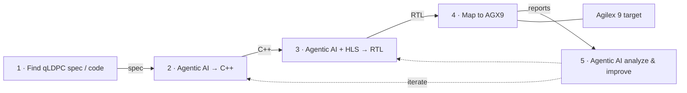

# qLDPC Decoder — Agentic AI Design Flow

End-to-end workflow for implementing a **quantum LDPC (qLDPC)** decoder on **Agilex 9 (AGX9)**: discover specification and reference code, use agentic AI to produce C++ and HLS-generated RTL, map to AGX9 for performance estimation, then analyze and iterate.

## Pipeline overview

## Steps

### 1. Find relevant qLDPC spec or reference code

**Actor:** Research

Locate the algorithm specification, parity-check structure, and reference decoder implementation (C++ / Python).

| | |
|---|---|
| **Inputs** | Literature, open-source repos, customer specs |
| **Outputs** | Algorithm definition, parity matrix, golden model |
| **Key metrics** | Code distance, block size, decode schedule |

---

### 2. Agentic AI creates SYCL code

**Actor:** Agentic AI

Produce a synthesizable SYCL model from the spec and reference code, suitable for simulation and HLS.

| | |
|---|---|
| **Tools** | Cursor agent, SYCL testbench |
| **Outputs** | Synthesizable SYCL decoder (simulation + HLS-ready) |
| **Key metrics** | Functional correctness vs golden model |

---

### 3. Agentic AI + HLS generates RTL

**Actor:** Agentic AI + HLS

Compile SYCL through HLS to RTL: datapath, interfaces, and pragmas.

| | |
|---|---|
| **Tools** | Altera HLS (ahls), agent-guided pragmas |
| **Outputs** | Verilog/VHDL netlist; resource & II estimates |
| **Key metrics** | Initiation interval (II), latency, DSP/LUT estimate |

---

### 4. Map RTL to AGX9 FPGA

**Actor:** FPGA estimate

Place and route on **Agilex 9 (AGX9)** and report performance and resource utilization.

| | |
|---|---|
| **Tools** | Quartus compile, Timing Analyzer |
| **Outputs** | Fmax, LUT/BRAM/DSP usage, latency, throughput projection |
| **Key metrics** | Fmax, setup/hold, resource utilization |

---

### 5. Agentic AI analyzes and improves design performance

**Actor:** Agentic AI

Review AGX9 compile and HLS reports, identify bottlenecks, and propose design changes.

| | |
|---|---|
| **Tools** | Agent + HLS reports + timing reports |
| **Outputs** | Design tweaks; loop back to steps 2–4 |
| **Key metrics** | Throughput, decode latency, area trade-offs |

---

## Iteration loop

Step 5 closes the loop. Agentic AI reads AGX9 compile and HLS reports, identifies bottlenecks (e.g. memory ports, unroll factor, graph structure), and proposes changes to the C++ source or HLS directives before re-synthesizing and re-estimating on AGX9.

**Iterate until AGX9 performance targets are met.**

## Stage summary

| Step | Activity | Output |
|------|----------|--------|
| 1 | Find relevant qLDPC spec or reference code | Algorithm definition, parity matrix, golden model |
| 2 | Agentic AI creates C++ code | Synthesizable C++ decoder; functional sim vs golden model |
| 3 | Agentic AI + HLS generates RTL | Verilog/VHDL netlist; II, latency, DSP/LUT estimate |
| 4 | Map RTL to AGX9 FPGA | Fmax, setup/hold, resource utilization, throughput projection |
| 5 | Agentic AI analyzes & improves design performance | Design tweaks; loop back to steps 2–4 |

## Related artifacts

- Slide: `qldpc-agentic-design-flow.pptx`
- Generator: `build_qldpc_slide.py`
